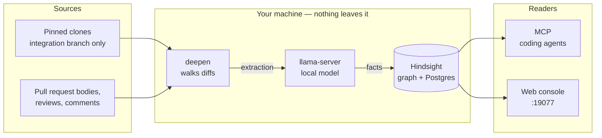
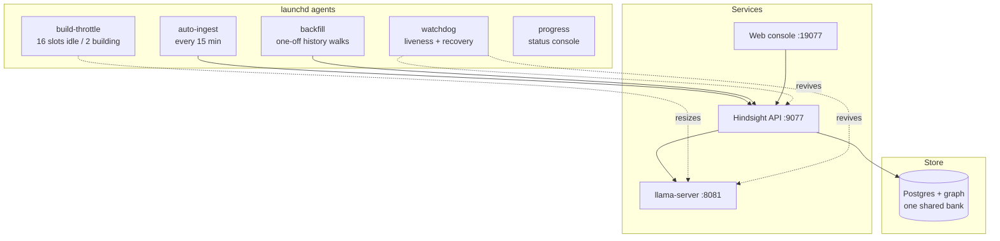
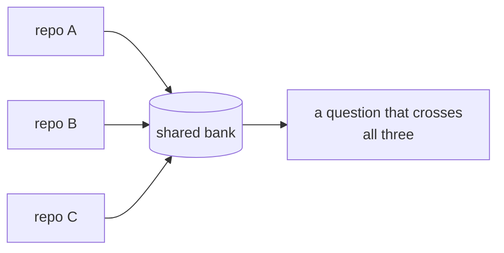
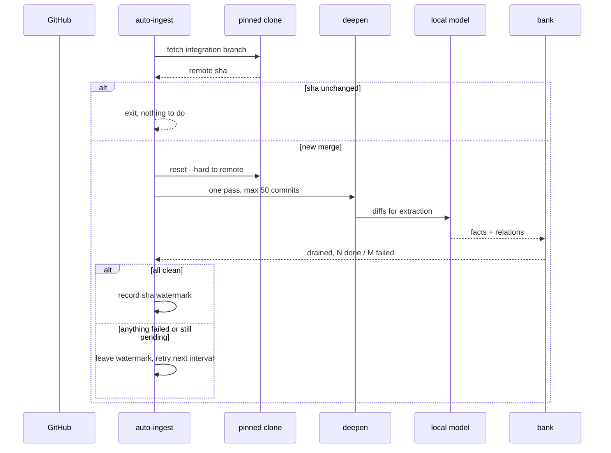

# hindsight-code-brain

A fully local, always-on memory of everything your team has ever merged.

It walks the git history of every repository you hold, reads the **actual
diffs** rather than the commit messages, extracts the facts with a model running
on your own machine, and stores them in a connected graph you can ask questions
of. Then it keeps itself current: when something merges, the brain knows within
fifteen minutes.

Nothing leaves the machine. No source, no diffs, no prompts.

> Built on [Hindsight](https://github.com/vectorize-io/hindsight) by the
> [Vectorize](https://vectorize.io) team, whose
> [coding-agents integration](https://github.com/vectorize-io/hindsight/tree/main/hindsight-integrations/coding-agents)
> provides the retain/recall/reflect engine and the `deepen` ingest this project
> drives. The memory model is theirs; this repository is the operational layer
> around it.

---

## Why

Ask any team "why is this code like this?" and the honest answer lives in three
places none of which you can grep: the pull request discussion, the commit that
fixed it six months ago, and somebody's head.

Code search finds you *what* the code is. It cannot tell you what was tried and
reverted, which approach was rejected and why, or that the odd-looking guard on
line 40 exists because of an outage. That context is in your git history
already — it is simply not in a shape anything can read.

### Why not just index commit messages?

Because they are mostly worthless. In the repositories this was built against, a
large share of older commit messages are some variant of `WIP`, `fixes`, or
`address review`. A commit message is a claim about a change; the diff *is* the
change. The brain reads diffs.

---

## What it does



Four things make it work in practice rather than in a demo:

**It reads diffs, not messages.** Each commit's real patch goes to the model,
which extracts what changed and why, and links it to the entities it touches.
Those links are what let a question cross a repository boundary.

**It reads from a pinned clone, never your working tree.** Your checkout moves
branch several times a day, carries rebased and abandoned commits, and is
mid-edit most of the time. Ingesting from it records history that never
happened. Each repository gets a clone pinned to the branch it actually
integrates on.

**It keeps itself current.** A watcher polls each pinned clone's integration
branch and ingests whatever merged, one bounded pass at a time, so a merge
never turns into a surprise multi-hour backfill.

**It yields the machine when you need it.** A throttle watches for compiler and
test processes and drops the model from sixteen slots to two while you build,
then takes them back when you stop.

---

## Architecture



Everything is a launchd user agent, because the alternative — a long-lived
process started from a terminal — does not survive the terminal. `nohup`
protects against `SIGHUP` but not against the process-group teardown an IDE
shell performs on exit, which is a thing you discover by losing a multi-hour run
twenty seconds in.

### One shared bank

Every repository ingests into a single Hindsight bank. Banks are hard-isolated
from each other, so one bank per repository would give you a brain per
repository and no way to ask a question that spans two. Repository identity is
preserved as a document tag instead, which keeps filtering available without
severing the graph.



---

## Ingest flow



The watermark is written **only on success**. Recording completion before it
has happened is how work gets silently skipped, and that failure is invisible
precisely because everything downstream then behaves as though the work is done.

---

## Install

Requires macOS, [uv](https://github.com/astral-sh/uv), Node 20+, and a local
OpenAI-compatible model server (this was built against `llama-server` from
`llama.cpp`, serving a 35B-class MoE at 16 slots on 48 GB of unified memory).

```bash
git clone https://github.com/elliott-wave-labs/hindsight-code-brain.git
cd hindsight-code-brain
./scripts/install.sh
```

The installer substitutes real paths into the launchd plists (a plist cannot
expand `$HOME` itself, so the tracked copies carry a `__HOME__` placeholder),
installs the agents, and writes a config template.

Then pin the repositories you want remembered:

```bash
./scripts/pin-repo.sh my-app dev
./scripts/pin-repo.sh my-service          # branch defaults to the remote HEAD
```

> **Pick the branch by most recent commit, not by "is dev ahead of main".**
> Diverged branches are each ahead of the other, so that test happily pins you
> to a branch that was abandoned a year ago. Recency is the honest signal.

To walk a repository's existing history once, add it to the backfill queue:

```bash
echo my-app >> ~/.hindsight/deployment/backfill.queue
launchctl kickstart gui/$(id -u)/com.hindsight.backfill
```

### Day-to-day

```bash
hs status      # agents, model, bank size, what is running
hs pause       # stop all ingest, unload the model, keep the brain queryable
hs resume      # bring it all back
hs slots 8     # resize the model's parallel slots
```

The web console is at **http://localhost:19077**.

---

## Reading it from an agent

Hindsight exposes an MCP server, so any MCP-capable coding agent can query the
brain directly. `skills/hindsight-code-brain/SKILL.md` is a drop-in skill that
teaches an agent when to reach for it — the short version being *before*
grepping, for any question shaped like "why is this like this", "who decided
that", "what was rejected", or "when did this change".

---

## Does it actually help?

[docs/case-study.md](docs/case-study.md) measures a real estate — the client,
backend, contracts and Terraform of a popular social live-streaming app, 17
repositories and 46,871 memory units, anonymized.

The headline measurement: **every protocol contract in active use spans at
least two repositories, 80% span three or more, and 78% cross a
client/backend/infrastructure boundary.** A coding agent pointed at one
repository is reasoning from one side of an agreement whose other side it
cannot see.

That document is also explicit about what has *not* been measured — there is no
controlled benchmark of agent accuracy yet, and the case study says so.

## Coming in v2

**Reactive ingest instead of polling.** A merge is an event the forge already
knows about, and polling rediscovers it on an interval while paying a fetch per
repository. The obvious fix does not work as stated: a hosted CI runner cannot
reach a laptop behind NAT, and opening an inbound path to a machine holding
your whole organisation's source is a bad trade for fifteen minutes of latency.
A **self-hosted runner** is the version that works — it dials out, so there is
no inbound hole, and the event carries the sha. `scripts/auto-ingest.sh`
documents the three properties that must survive that move.

**A server for the whole organisation.** A laptop can hold the repositories one
person works in. Covering several hundred repositories is a server's job, and
that server is also where reactive ingest and multi-user access belong.

**Richer sources.** Issue trackers, design documents and incident history are
all the same shape of problem as pull requests.

---

## Contributing and licence

See [CONTRIBUTING.md](CONTRIBUTING.md). Issues and pull requests welcome;
`scripts/check-clean.sh` runs in CI and will fail a change that leaks absolute
paths or credentials.

MIT, © Elliott Wave LLC — see [LICENSE](LICENSE).

**Patent rights are reserved separately, and making this repository public
starts a patent clock** — twelve months in the US, and in most other
jurisdictions publication ends patentability outright. See
[PATENTS.md](PATENTS.md) before publishing a fork.
