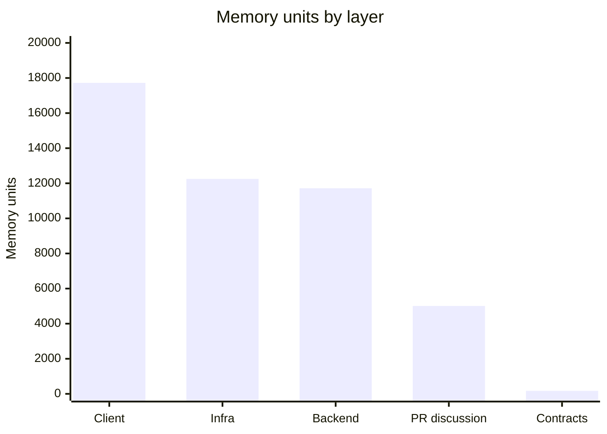
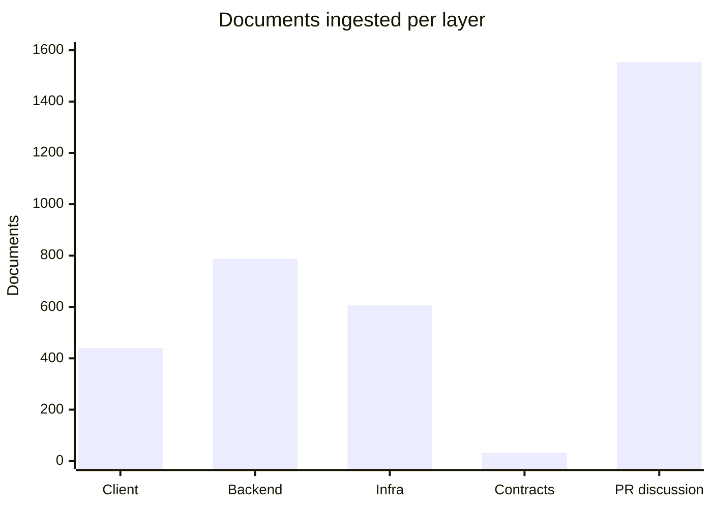
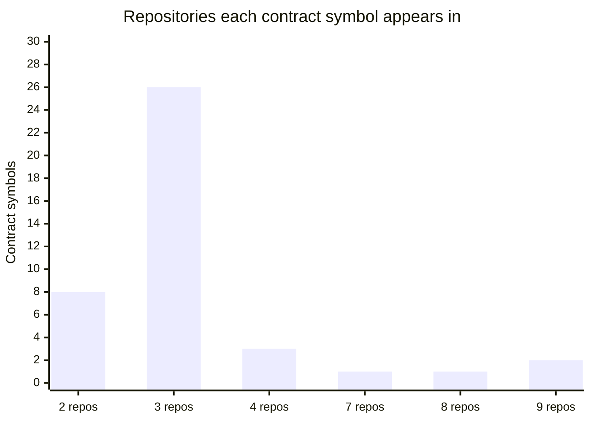
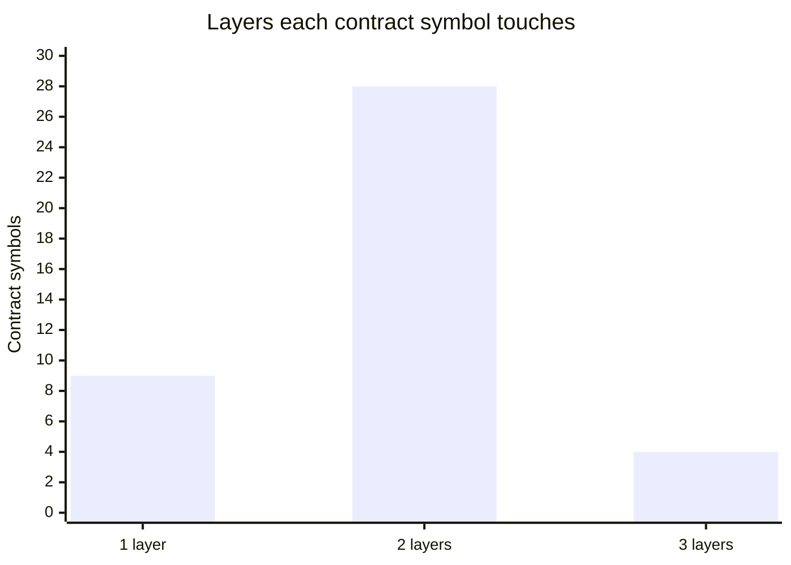
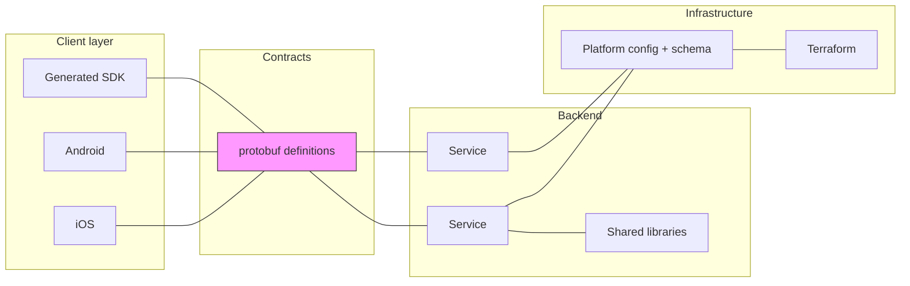

# Case study: a social live-streaming app

What happens when the brain holds the **client, the backend, and the
infrastructure** at once, instead of one repository at a time.

The system under test is the engineering estate of a popular social
live-streaming product: native mobile clients, a set of backend services, the
protocol contracts between them, and the Terraform and platform configuration
they run on. Repository names, people and identifiers are removed throughout;
every number below is measured from the real corpus.

## Contents

- [What was ingested](#what-was-ingested)
- [Why one repository is not enough](#why-one-repository-is-not-enough)
- [Contract coupling, measured](#contract-coupling-measured)
- [Where the knowledge actually lives](#where-the-knowledge-actually-lives)
- [What this does and does not prove](#what-this-does-and-does-not-prove)

---

## What was ingested

17 repositories across four layers, read as **diffs and pull request
discussion** rather than commit messages: 3,420 documents producing **46,871
memory units** in a single shared graph.

**The real source is ingested — every line of every diff — and none of it
leaves the machine.** That combination is the point. The extraction model runs
locally, so proprietary code is read in full without being sent to a hosted
API, and the thing that persists afterwards is not the code: it is what was
understood from it. Facts, entities, and the relationships between them.

The distinction matters, because the two usual options are both bad. Send your
source to a third-party model and you have disclosed it. Index only what is
safe to disclose — file names, public signatures, commit subjects — and you
have an index of labels rather than an understanding of behaviour. Running the
model locally removes the trade entirely: full fidelity *and* full privacy.

What accumulates is closer to experience than to a search index. A single
commit becomes several memory units, each linked to the entities it touches, so
the graph gradually acquires the thing a long-tenured engineer has and a new
hire does not — not *where* the code is, but *how this system behaves*, which
approaches were tried and abandoned, and which parts are connected in ways no
file reveals.

Client is the mobile apps and their generated SDK; infrastructure is Terraform,
platform configuration and schema migrations; backend is the services and the
libraries they share; contracts are the protobuf definitions between them.

The shape is worth sitting with. **Infrastructure is not a rounding error** —
at 12,248 units it is comparable to the entire backend, and an agent that
indexes application code only is missing a quarter of what the organisation
knows about how its own system behaves.

The contracts layer is the inverse: 171 units, 0.4% of the corpus, and as the
next section shows it is the connective tissue holding the other three
together. Volume is a poor proxy for importance.

---

## Why one repository is not enough

A coding agent is usually pointed at one repository — the one it has open. The
question is whether that is sufficient, and the estate answers it directly.

Taking every message, service and enum defined in the shared contract
repository and looking for each one across the client and backend code:

**Not one symbol in active use appears in only one repository.** Every single
one spans at least two, 80% span three or more, and a handful appear in nine.

That is the whole argument in one measurement. A definition an agent can see,
whose every use lives in repositories it cannot, is a definition it does not
understand. It can tell you the field exists. It cannot tell you that one
client treats absence as `false` while the service that writes it never sends
`false` at all — which is the kind of thing that produces a bug no amount of
reading either repository alone would have caught.

---

## Contract coupling, measured

Grouping those same symbols by **layer** rather than by repository:

**78% of contract symbols cross a layer boundary.** Roughly four in five of the
things the system agrees on are agreements between a client and a service, or
between a service and the infrastructure it runs on — not internal details of
either.

The contract layer is 0.4% of the corpus by volume and sits on the path between
almost every pair of layers. An agent that has indexed the client and the
contracts, but not the services, has indexed one end of 78% of the system's
agreements.

---

## Where the knowledge actually lives

**Pull request discussion is 45% of the documents.** 1,554 of 3,420 documents
are PR conversation rather than code.

That is a large fraction of the corpus, and none of it is in a checkout. A
reviewer explaining why an approach was rejected, the question that changed a
design, the "we tried that and it deadlocked" — all of it lives beside the
repository rather than in it, and is unreachable by any tool that reads files.

The same reasoning drives reading diffs rather than commit messages. A commit
message is a claim *about* a change, written in a hurry, and frequently a
single word; the diff **is** the change. The brain reads both the diff and the
discussion around it, which is why one commit can produce several memory
units — the 46,871 units above come from 1,866 ingested commits.

---

## What this does and does not prove

Being precise about this, because the distinction matters.

**Measured, from the real corpus:**

- 17 repositories, 3,420 documents, 46,871 memory units in one connected graph.
- Infrastructure contributes 12,248 units — comparable to the whole backend.
- 100% of in-use contract symbols span 2+ repositories; 80% span 3+.
- 78% of contract symbols cross a client/backend/infrastructure boundary.
- 45% of ingested documents are pull request discussion, not code.

**Not measured:** we have not run a controlled benchmark comparing agent task
accuracy with the brain against without it. That experiment needs a held-out
question set and blind grading, and it has not been done. Any claim here about
agents answering *better* is an inference from the coupling data, not a
measurement of agent output.

What the coupling data does establish is narrower and still useful: **a
single-repository view is structurally incomplete for this estate**, and that
incompleteness is quantified rather than asserted. Every contract in active use
is an agreement spanning repositories, and four in five span layers. An agent
reasoning from one repository is reasoning from one side of an agreement whose
other side it cannot see.

Whether closing that gap improves answers is the next thing to measure, and the
honest position until then is that it is a hypothesis with good structural
evidence behind it.
